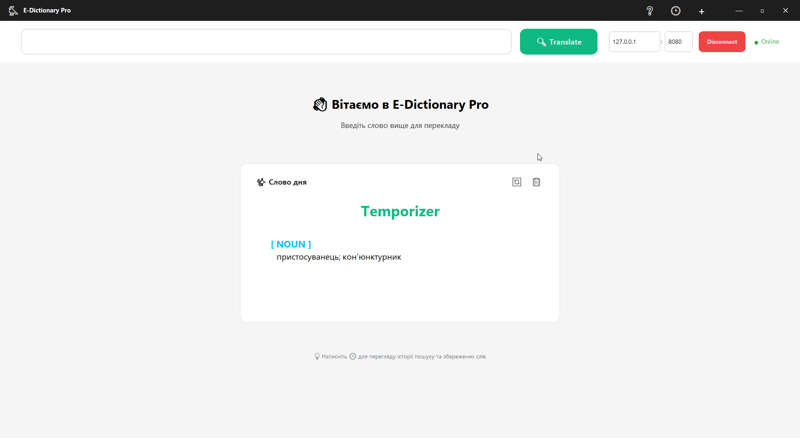
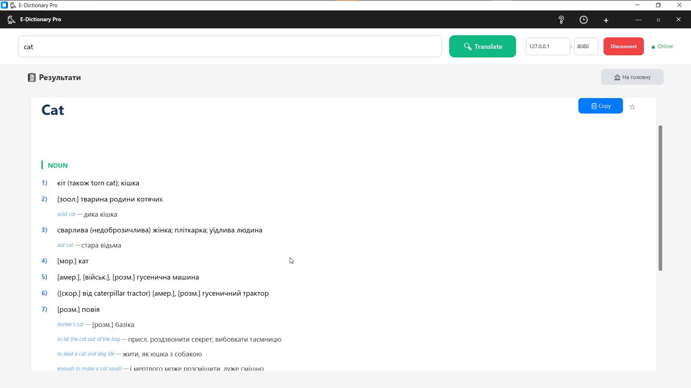
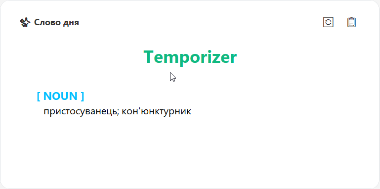
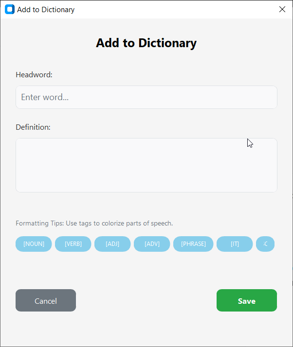

# 🦉 E-Dictionary Pro

**Курсова робота з дисципліни "Об'єктно-орієнтоване програмування"**


**E-Dictionary Pro** — сучасна клієнт-серверна система електронного словника. Проєкт демонструє застосування принципів ООП для створення швидкого, масштабованого та зручного програмного продукту. Система підтримує миттєвий переклад, збереження історії та динамічне розширення словникової бази.

---

## 📸 Інтерфейс

| Головне вікно | Результат пошуку |
|:---:|:---:|
|  |  |

| Слово дня | Додавання слів |
|:---:|:---:|
|  |  |

*(Примітка: Зображення знаходяться в папці `screenshots`)*

---

## 🚀 Функціональні можливості

* **🔍 Миттєвий переклад:** Використання оптимізованих структур (`std::map`) на C++ забезпечує пошук за час O(log n).  
* **💾 База даних SQLite:** Надійне зберігання словникової бази на сервері та історії пошуку на клієнті.  
* **➕ Динамічне поповнення:** Можливість додавати нові слова, які миттєво зберігаються в базу даних і стають доступними для пошуку.  
* **📜 Розумна Історія:** Локальне збереження запитів з можливістю очищення та повторного пошуку.  
* **⭐ Обране:** Можливість зберігати важливі слова для подальшого вивчення.  
* **🎨 Modern UI:** Адаптивний графічний інтерфейс на базі `CustomTkinter` з підтримкою скролінгу та форматування тексту.  

---

## 🛠️ Технічний стек

### Backend (Сервер)
* **Мова:** C++ (ISO C++17)  
* **Мережа:** Winsock2 API (TCP/IP Sockets)  
* **База даних:** SQLite (C Interface) — файл `eng_ukr_dictionary.db`  
* **Особливості:** Багатопотокова обробка, прямий запис у БД, логування операцій  

### Frontend (Клієнт)
* **Мова:** Python 3.12  
* **GUI:** CustomTkinter  
* **База даних:** SQLite (`dictionary_history.db`) — для локальних даних користувача  
* **Мережа:** Модуль `socket` для комунікації з сервером  

---

## 📂 Структура проєкту

```text
E-Dictionary-Pro/
├── Backend/                  # Серверна частина (C++)
│   ├── server.cpp            # Основний код сервера
│   ├── server.exe            # Скомпільований файл
│   ├── eng_ukr_dictionary.db # Головна база даних
│   ├── sqlite3.h / .c        # Бібліотека SQLite
│   └── dictionary.txt        # Резервна копія словника
├── Frontend/                 # Клієнтська частина (Python)
│   ├── main.py               # Точка входу
│   ├── ui_components.py      # Графічний інтерфейс (UI)
│   ├── network_manager.py    # Робота з мережею
│   ├── database_manager.py   # Локальна історія
│   └── dictionary_history.db # Файл локальної БД
└── Doc/                      # Документація (Звіт)
```
## ⚙️ Інструкція із запуску

### 1. Запуск Сервера 
**Важливо:** сервер повинен бути запущений перед клієнтом.
1. Перейдіть у папку `Backend`
2. Запустіть файл server.exe
3. Зачекайте повідомлення в консолі: 
```text 
[OK] Bound to 127.0.0.1:8080
```


### 2. Запуск Клієнта (Python)

1. Встановіть необхідну бібліотеку: 
```bash
pip install customtkinter
```

2. Перейдіть у папку `Frontend/` та запустіть: 
```bash
python main.py
```

3. У вікні програми натисніть кнопку **Connect**

---

## 👤 Автор

**Студент групи ОІ-22 Петрунів Дмитро**  
Національний університет "Львівська політехніка"
## 📅 Release

**Версія:** v1.0  
**Рік:** 2025
